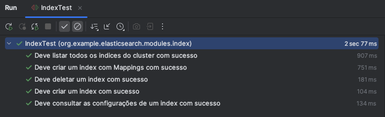

# Automação de Testes com RestAssured para Elasticsearch

Este projeto tem como objetivo demonstrar como utilizar o RestAssured para automatizar testes de APIs do Elasticsearch. O projeto inclui exemplos de como realizar operações básicas de teste, como criação de índices, inserção de documentos e buscas.
## Pré-requisitos

Antes de começar, você precisa ter os seguintes softwares instalados:

- **[Java 11 ou superior](https://www.oracle.com/java/technologies/downloads/)**: O projeto é desenvolvido em Java, então você precisa ter o Java JDK instalado.
- **[Maven](https://maven.apache.org/install.html)**: Usado para gerenciar dependências e construir o projeto.
- **[Docker](https://docs.docker.com/engine/install/)**: Para rodar o Elasticsearch em um contêiner.
- **Docker Compose**: Para gerenciar e orquestrar múltiplos contêineres Docker.

## Configuração do Ambiente

### 1. Clonar o projeto

Clone este repositório para o seu ambiente local:

```bash
git clone https://github.com/seu-usuario/projeto-restassured-elasticsearch.git
cd projeto-restassured-elasticsearch
```

### 2. Instale as depências

O projeto utiliza Maven como gerenciador de dependências. Instale as dependências do projeto:

```bash
mvn install
```

### 3. Executar Elasticsearch com Docker

Para executar o Elasticsearch, utilize o arquivo `docker-compose.yml` fornecido:

```bash
docker-compose up -d
```
Isso iniciará o Elasticsearch e o Kibana. Certifique-se de que os serviços estão rodando corretamente nas respectivas URLs
- **Kibana**: Abra o navegador e digite: `localhost/5601`
- **Elasticsearch server(_node 1_)**: Verifique com o docker se está url está preenchida:`https://es01:9200`

#### Senhas de acesso

- As senhas para acessar os serviços estão no arquivo `.env`na pasta raíz do projeto, este arquivo é usado pelo compose na criação dos containers
- A váriavel abaixo pode ser editada como preferir, você irá utilizar ela para se autenticar no Kibana via Web e no Elasticsearch.

```text
# Password for the 'elastic' user (at least 6 characters)
ELASTIC_PASSWORD=elk2324
```

> **⚠️ Aviso:**
>
> Ao subir o container, automaticamente o Docker irá criar na pasta raiz `/certs` os certificados do servidor Elasticsearch. Por isso, realizamos as autenticações na URL `localhost:9200` com `https://` e mTLS.
>
> Tenha apenas como aviso, no projeto você verá como o RestAssured anexa o certificado na requisição.


> **❌ Caso de Erro:**
> 
> Se encontrar problemas com os certificados, basta excluir a pasta `/certs` e executar o `docker-compose` novamente para regenerá-los.

Para mais informações sobre as APIs do Elasticsearch e sua documentação, acesse o link:
- [ELK REST API Documentation](https://www.elastic.co/guide/en/elasticsearch/reference/current/rest-apis.html)

## Estrutura do projeto

#### 🤔 Por que Escolhemos o Elasticsearch para Praticar Testes Automatizados de APIs Rest?
O Elasticsearch se destaca como uma escolha ideal para a prática de testes automatizados, e aqui estão os principais motivos:
- Rica Coleção de APIs REST: O Elasticsearch oferece uma vasta gama de APIs RESTful, permitindo a simulação de cenários de teste que se assemelham muito a situações reais do mundo corporativo. Com ele, é possível testar desde operações simples até as mais complexas, garantindo a robustez e a eficácia dos seus testes automatizados.
- Versatilidade e Relevância: O Elasticsearch é amplamente utilizado em várias indústrias para pesquisa, análise e armazenamento de dados. Ao praticar testes automatizados com o Elasticsearch, você está aprendendo a testar em um ambiente que reflete desafios reais, aprimorando suas habilidades de QA em contextos altamente relevantes e atuais.
- Capacidade de Escalabilidade: Com suporte a grandes volumes de dados e operações complexas, o Elasticsearch é perfeito para testar a escalabilidade e a performance de sistemas, preparando você para enfrentar desafios de teste em ambientes de produção. 
- Testes automatizados de APIs REST são frequentemente mais rápidos e econômicos do que testes End-To-End de Interface Gráfica, conforme ressaltado por Martin Fowler em `Refactoring (1999)`, onde ele destaca a eficiência dos testes de integração em comparação com testes de interface devido à sua menor complexidade e maior foco na lógica de negócio.


### 📊 Índices e Documentos no Elasticsearch

### 📚 O que são Índices?
Um **índice** no Elasticsearch é como um banco de dados em um sistema de banco de dados relacional. Ele armazena documentos relacionados e é identificado por um nome. Os índices são organizados em shards, que permitem a escalabilidade horizontal.

#### 🔧 Operações Comuns em Índices que iremos automatizar:
- **Criação de Índice**: Um novo índice pode ser criado para armazenar documentos.
- **Deleção de Índice**: Remova completamente um índice e todos os seus documentos associados.
- **Atualização de Índice**: Atualize as configurações e mapeamentos de um índice existente.
- **Consulta de Índices**: Obtenha informações sobre o status e configuração dos índices.

```bash
# Exemplo de criação de índice usando a API do Elasticsearch
PUT /meu_novo_indice
{
  "settings": {
    "number_of_shards": 3,
    "number_of_replicas": 2
  }
}
```

Com o RestAssured, podemos criar um teste automatizado para criar um Indice no servidor da seguinte forma:

```java
  @DisplayName("Deve criar um index com Mappings com sucesso")
  @Test
  public void testShouldCreateIndexWithMappings() {
    IndexPojo indexPojo = IndexDataFactory.createIndexWithSampleMappings();
    Response response = IndexCommands.createIndexWithMappings(indexPojo);

    response
      .then()
        .statusCode(200)
        .body("acknowledged", equalTo(true))
        .body("shards_acknowledged", equalTo(true))
        .body("index", equalTo(indexPojo.getName()));
  }
```

### 📄 O que são Documentos?

Um documento é uma unidade básica de informação no Elasticsearch, armazenada em um índice. Cada documento é representado
em formato JSON e contém dados estruturados.

#### 🔧 Operações Comuns em Documentos que iremos automatizar:
- Criação/Indexação de Documento: Insere um novo documento em um índice.
- Atualização de Documento: Modifica os dados de um documento existente.
- Deleção de Documento: Remove um documento específico de um índice.
- Busca de Documentos: Recupere documentos com base em consultas flexíveis e poderosas.

```bash
#Exemplo de indexação de documento usando a API do Elasticsearch
POST /meu_novo_indice/_doc/1
{
"nome": "João",
"idade": 30,
"cargo": "Desenvolvedor"
}
```

Com o RestAssured teremos um teste como:

```java
@DisplayName("Deve criar um documento com sucesso")
@Test
public void testShouldCreateDocument() {
    // Dados de exemplo para o documento
    String indexName = "meu_indice";
    String documentId = "1";
    Map<String, Object> documentData = new HashMap<>();
    documentData.put("nome", "João");
    documentData.put("idade", 30);
    documentData.put("cargo", "Desenvolvedor");

    // Criação do documento
    Response response = DocumentCommands.createDocument(indexName, documentId, documentData);

    response
      .then()
        .statusCode(201) // Verifica se o documento foi criado com sucesso
        .body("_index", equalTo(indexName))
        .body("_id", equalTo(documentId))
        .body("result", equalTo("created"));
}
```
## 🤝 Como Contribuir
- Relate Problemas: Abra um issue para bugs ou sugestões.
- Submeta Melhorias: Faça um pull request com suas mudanças.
- Revise Pull Requests: Ajude revisando e dando feedback.
- Documentação: Melhore ou corrija a documentação.


